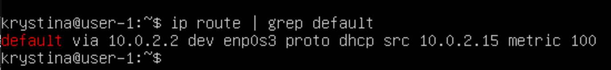
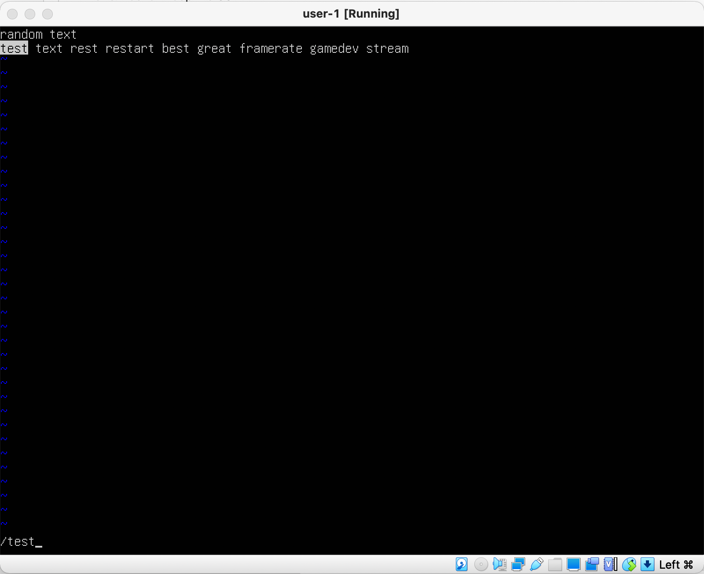
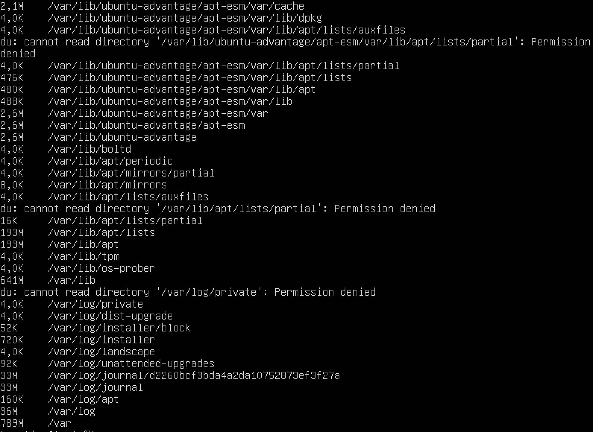

## Part 1. Установка ОС

1.  Установил Ubuntu 20.04 Server LTS без графического интерфейса.
    
    рис.1 Установка ОС

## Part 2. Создание пользователя

1.  Создал пользователя, отличного от пользователя, который создавался при установке.
    
    рис.2 Создание пользователя

## Part 3. Настройка сети ОС

1.  Задал название машины вида user-1, изменив файлы /etc/hostname и etc/.
2.  Установил временную зону, соответствующую текущему местоположению (Europe/Moscow), используя команду "sudo timedatectl set-timezone America/New_York".
3.  Вывел названия сетевых интерфейсов с помощью консольной команды.
    
    рис.3 Переименование, вывод даты и сетевых интерфейсов
    lo(looback device) - неотъемлимая часть unix-систем. Используется для запуска серверных приложений и реализации виртуального сетевого интерфейса. Неудевительно, что команда ip вывела его название.
4.  Используя консольную команду "hostname -I" получил ip адрес устройства, на котором работал, от DHCP сервера.
    
    рис.4 ip-адресс устройства
    DHCP(англ. Протокол динамической настройки узла) - это протокол, который автоматически предоставляет ip и другие связанные сведения о конфигурации, такие как маска подсети и шлюз по умолчанию.
5.  Определил и вывел на экран внешний ip-адрес шлюза (10.0.2.2) и внутренний IP-адрес шлюза, он же ip-адрес по умолчанию (10.0.2.15), используя команду ip route.
    
    рис.5 ip-адреса
6.  Задал статичные настройки, используя публичные DNS (1.1.1.1 и 8.8.8.8)
    
    рис.6 пинг ya.ru
    
    рис.7 пинг 1.1.1.1
7.  Убедился, что статичные сетевые настройки соответствуют заданным в предыдущем пункте
    
    рис.8 настройки

## Part 4. Обновление ОС

1. Обновил системные пакеты до последней на момент выполнения задания версии.
    
    рис.9 Upgrade

## Part 5. Использование команды sudo

Команда sudo(от англ. Подменить пользователя и сделать) предоставляет возможность пользователям выполнять команды от имени суперпользователя root, либо других пользователей.

1. Разрешил пользователю, созданному в Part 2, выполнять команду sudo. Поменял hostname OC от имени пользователя, созданного в Part 2.
    
    рис.10 

## Part 6. Установка и настройка службы времени

1.  Натсроил службу автоматической синхронизации времени.
    
    рис.11 время

## Part 7. Установка и использование текстовых редакторов

1.  Установил текстовые редакторы VIM, NANO, JOE (sudo apt update, sudo apt install)
2.  Создал файлы используя текстовые редакторы
    
    - VIM. Для выхода из редактора и сохранения файла набрал :w test_VIM.txt.
    
    рис.12 VIM
    
    - NANO. Для выхода из редактора и сохранения файла набрал CTRL + O далее в появившейся строке набрал test_NANO.txt. Далее Enter, выход из редактора CTRL + X.
    
    рис.13 nano
    
    - JOE. Для выхода из редактора и сохранения файла набрал Ctrl + K, далее Q и Y ввёл название файла test_JOE.txt.
    
    рис.14 joe

3.  Используя каждый из трех выбранных редакторов, открыл файл на редактирование, отредактировал файл, заменив никнейм на строку "21 School 21", закрыл файл без сохранения изменений.

    - VIM. Для выхода из редактора без сохранения файла набрал :q!
    
    рис.15 VIM AGAIN

    - NANO. Для выхода из редактора без сохранений нажал CTRL + X, затем N.
    
    рис.16 NANO AGAIN

    - JOE. Для выхода из редактора без сохранений нажал CTRL + C, затем Y(подтвердил отмену изменений).
    
    рис.17 JOE AGAIN

4. Используя каждый из трех выбранных редакторов, отредактировал файл ещё раз (по аналогии с предыдущим пунктом), а затем освоил функции поиска по содержимому файла (слово) и замены слова на любое другое.

    
    рис.18 VIM поиск

    
    рис.19 VIM замена

    Осуществил поиск при помощи комбинации клавиш CTRL + W
    
    рис.20 NANO поиск

    Осуществил замену при помощи комбинации клавиш CTRL + \
    
    рис.21 NANO замена

    Осуществил поиск при помощи последовательности клавиш CTRL + K, F
    
    рис.22 JOE поиск

    После поиска по слову нажал R для замены и ввёл текст, на который необходимо заменить, подтвердил замену, нажав Y
    
    рис.23 JOE замена

## Part 8. Установка и базовая настройка сервиса SSHD

1.  Установил службу SSHd
    
    рис.24 настройки SSH по умолчанию

2.  Добавил автостарт службы при загрузке системы (sudo systemctl enable sshd)

3.  Перенастроил службу на порт 2022 (sudo nano /etc/ssh/sshd_config). Перезапустил SSH-сервер, чтобы изменения вступили в силу (systemctl restart sshd)
    
    рис.25 настройка порта

4.  Используя команду ps, показал наличие процесса sshd, с помощью ключа -А
    
    рис.26 команда ps
    
    Команда ps выводит список текущих процессов на сервере в виде таблицы. Флаги:
    - -A, -e, (a) - выбрать все процессы;
    - -a - выбрать все процессы, кроме фоновых;
    - -d, (g) - выбрать все процессы, даже фоновые, кроме процессов сессий;
    - -N - выбрать все процессы кроме указанных;
    - -С - выбирать процессы по имени команды;
    - -G - выбрать процессы по ID группы;
    - -p, (p) - выбрать процессы PID;
    - --ppid - выбрать процессы по PID родительского процесса;
    - -s - выбрать процессы по ID сессии;
    - -t, (t) - выбрать процессы по tty;
    - -u, (U) - выбрать процессы пользователя.

5. Перезагрузил систему (sudo reboot)

    Команда netstat отображает различную информацию, такую как сетевые подключения, статистику интерфейсов, таблицы маршрутизации, и т.п.

    - -t информация по протоколам TCP;
    - -a информация о состояние всех сокетов (портов) прослушиваемых и нет;
    - -n информация о сетевых адресах показанных в формате числа;
    - 0.0.0.0:* это означает, что подключение может быть выполнено на любой внешний адрес

    
    рис.27 netstat

## Part 9. Установка и использование утилит top, htop

1.  Установил и запустили утилиты top и htop.
    
    Утилита top:
    - uptime: 33 min;
    - количество авторизованных пользователей: 1;
    - общая загрузка системы: 0,00;
    - общее количество прцоессов: 96;
    - загрузка cpu: 
        - процент использования центрального процессора пользовательскими процессам (us): 0,3;
        - процент использования центрального процессора системными процессами (sy): 0,3;
        - процент использования центрального процессора процессами с приоритетом, повышенным при помощи вызова (ni): 0,0;
        - процент времени, когда центральный процессор не используется (id): 99,3;
        - процент использования центрального процессора процессами, ожидающими завершения операций ввода-вывода (wa): 0,0;
        - Hardware IRQ (аппаратные прерывания) — процент использования центрального процессора обработчиками аппаратных прерываний (hi): 0,0;
        - Software Interrupts (программные прерывания) — процент использования центрального процессора обработчиками программных прерываний (si): 0,0;
        - Steal Time (заимствованное время) — количество ресурсов центрального процессора "заимствованных" у виртуальной машины гипервизором для других задач (таких, как запуск другой виртуальной машины); это значение будет равно нулю на настольных компьютерах и серверах, не использующих виртуальные машины (st): 0,0;
    - загрузка памяти:
        - физическая память(Mem):
            - общее количество памяти (total): 964,9;
            - количество используемой памяти (used): 154,7;
            - количество свободной памяти (free): 318,7;
            - количество памяти в кэше буферов (buffers): 491,5;
        - раздел подкачки(Swap):
            - общее количество памяти (total): 1514,0;
            - количество используемой памяти (used): 0,0;
            - количество свободной памяти (free): 1514,0;
            - память, которая может быть выделена для процессов, не использую большую область диска (avail Mem) (avail Mem): 663,2; 
    - pid процесса, занимающего больше всего памяти: 1;
    - pid процесса, занимающего больше всего процессорного времени: 1;

    
    рис.28 утилита TOP

    Утилита htop:

    
    рис.29 Утилита htop сортированная по pid

    
    рис.30 Утилита htop осортированная по PERCENT_CPU

    
    рис.31 Утилита htop осортированная по PERCENT_MEM

    
    рис.32 Утилита htop осортированная по TIME

    
    рис.33 Утилита htop отфильтрованная для процесса sshd

    
    рис.34 Утилита htop с процессом syslog

    
    рис.35 Утилита htop с добавленным выводом hostname, clock и uptime(через setup)

## Part 10. Использование утилиты fdisk

1.  Запустил команду fdisk -l.
    - название жесткого диска "sda";
    - его размер: 10 GiB (10737418240 bytes);
    - 20971520 секторов;
    - размер swap: 1,5 GiB;

    
    рис.36 Утилита fdisk 

## Part 11. Использование утилиты df

1.  Запустил команду df.
    - единица измерения: KiB;
    Для корневого раздела(/dev/mapper/ubuntu--vg-ubuntu--lv):
    - размер раздела: 8408452 KiB;
    - размер занятого пространства: 4761828 KiB;
    - размер свободного пространства: 3197908 KiB;
    - процент использования: 60%.

    
    рис.37 Команда df

2.  Запустил команду df -Th.
    - Тип файловой системы: ext4 ;
    Для корневого раздела(/dev/mapper/ubuntu--vg-ubuntu--lv):
    - размер раздела: 8,1 GiB;
    - размер занятого пространства: 4,6 GiB;
    - размер свободного пространства: 3,1 GiB;
    - процент использования: 60%;

    
    рис.37 Команда df -Th

## Part 12. Использование утилиты du

1.  Запустил команду du.

    
    рис.37,5 команда du

2.  Вывел размер папок /home, /var, /var/log (в байтах, в человекочитаемом виде)
    
    
    рис.38 размер /home

    
    рис.39 размер /var

    
    рис.40 размер /var/log

3.  Вывел размер всего содержимого в /var/log (не общее, а каждого вложенного элемента, используя *)

    
    рис.41 размер /var/log*

    
    рис.42 размер /var/log/*

## Part 13. Установка и использование утилиты ncdu

1.  Установил утилиту ncdu(sudo apt install ncdu).

    
    рис.43 команда ncdu

2.  Вывел размер папок /home, /var, /var/log.

    
    рис.44 размер /home

    
    рис.45 размер /var

    
    рис.46 размер /var/log

## Part 14. Работа с системными журналами

1.  Открыл логи для просмотра (cat).
    
    - Время последней успешной авторизации: 29 июля, 18:47:51;
    - Имя пользователя: krystina;
    - Метод входа в систему: sshd-соединение, с использование модуля pam_unix;
    
    
    рис.47 время, метод и пользователь последней успешной авторизации

2. Перезапустил службу SSHd

    
    рис.48 syslog с перезапуском

## Part 15. Использование планировщика заданий CRON

1.  Используя планировщик заданий, запустил команду uptime через каждые 2 минуты.
    
    - при помощи команды crontab -e отредактировал файл crontab;
    
    рис.49 crontab

    - нашёл в системных журналах строчки (минимум две в заданном временном диапазоне) о выполнении;
    
    рис.50 команда выполнилась дважды

    - командой crontab -l проверил список текущих задач для CRON;
    
    рис.51 список задач для CRON

    - при помощи команды crontab -r удалил все задания для планировщика заданий;
    - вывел на экран текущие задачи для CRON;
    
    рис.52 список последних задач